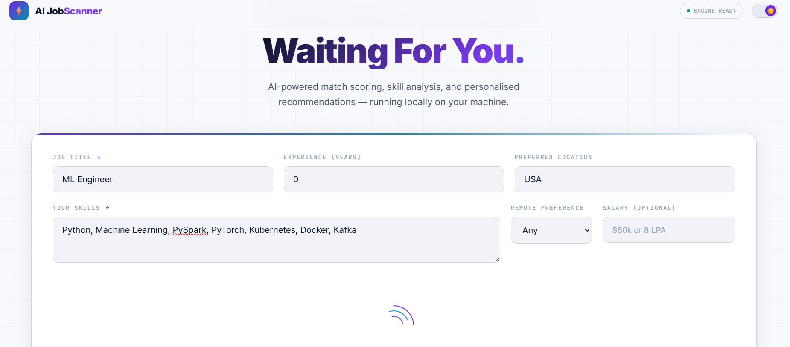
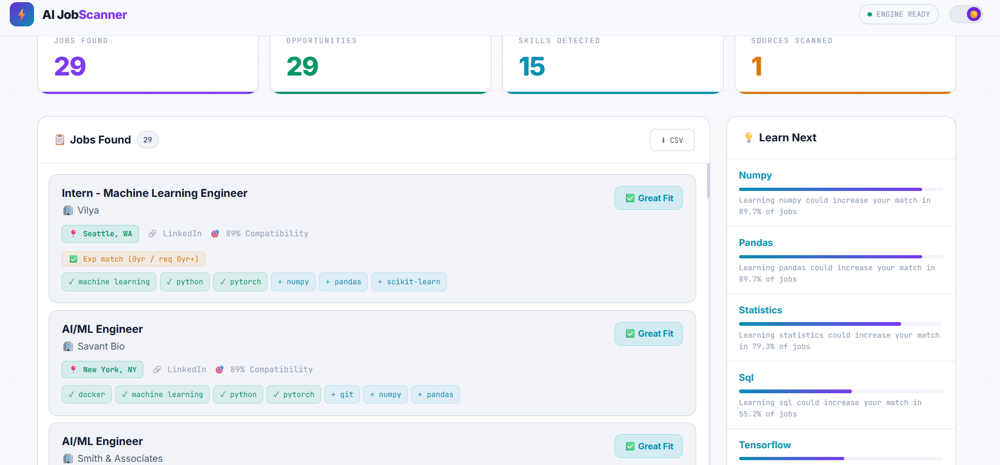
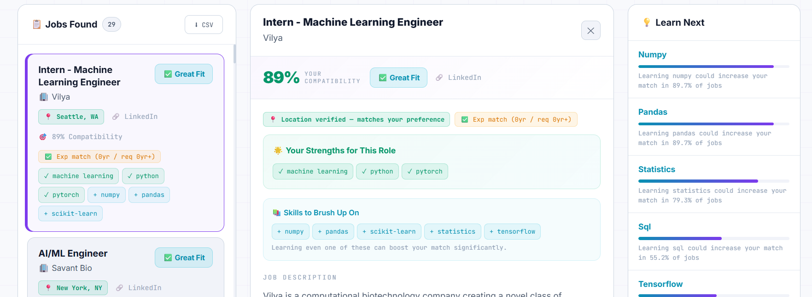
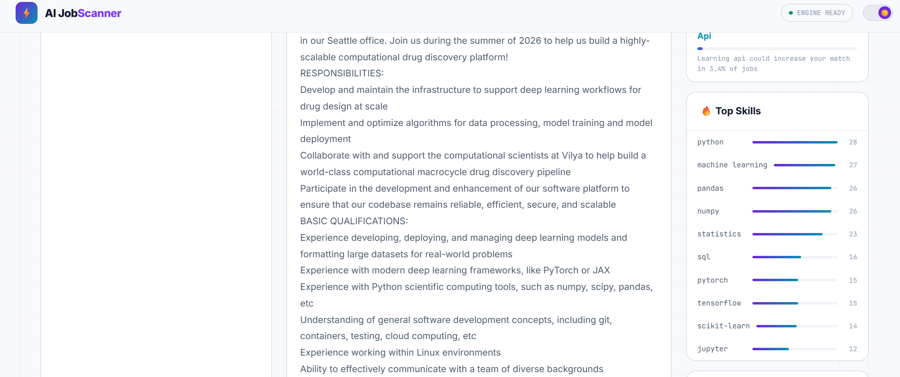
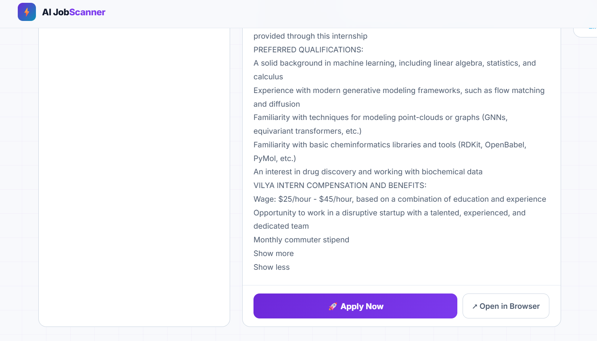

# AIJobScanner

AIJobScanner is a desktop tool that scans job listings and analyzes the skills companies actually look for.

Instead of manually reading dozens of job descriptions, the tool extracts the most demanded skills and compares them with your current skills to estimate your compatibility with different roles.

---

# Interface

The interface allows you to enter:

- Job role
- Your current skills
- Preferred location
- Experience level

The tool then scans job listings and analyzes the job market.

---

# Job Market Scanning

AIJobScanner scans multiple job listings and extracts the most common skills requested by companies.

---

# Job Match Results

The system calculates compatibility with different roles and highlights:

- Skill match
- Job compatibility
- Missing skills
- Opportunities

---

# Skill Recommendations

The tool suggests additional skills that could significantly improve your compatibility with job listings.

---

# Job Listing View

You can view the full job description and directly open the application page.

---

# Key Features

• Job listing analysis  
• Skill demand extraction  
• Compatibility scoring  
• Skill gap detection  
• Personalized recommendations  

---

# Use Cases

AIJobScanner helps:

- Students exploring career paths  
- Developers planning skill upgrades  
- Job seekers preparing for specific roles  
- Anyone trying to understand job market demand  

---

# Download

You can download the desktop application here:

https://techwizard322.gumroad.com/l/mpcni

---

# License

This repository contains documentation and updates.  
The software itself is distributed as a compiled desktop application.
